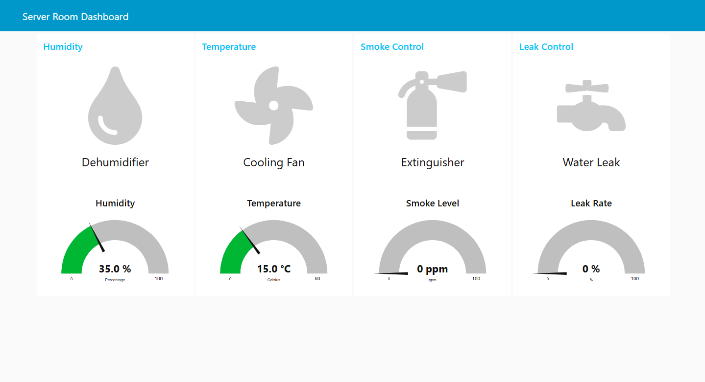
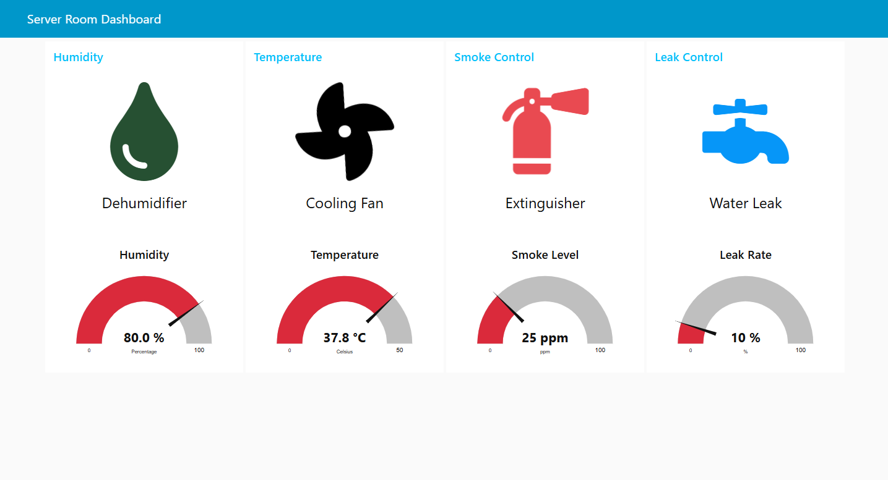
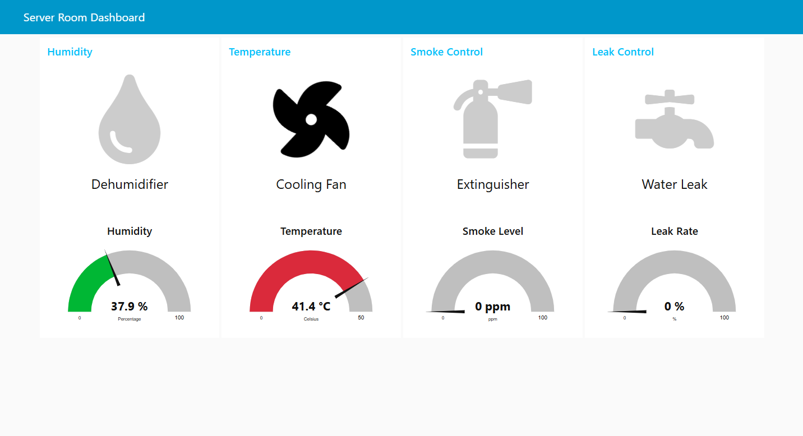
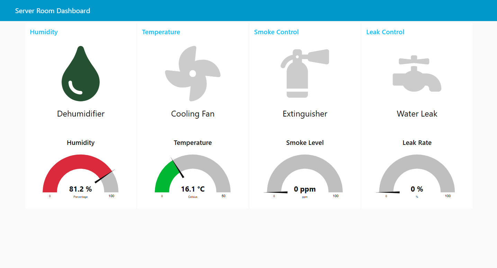
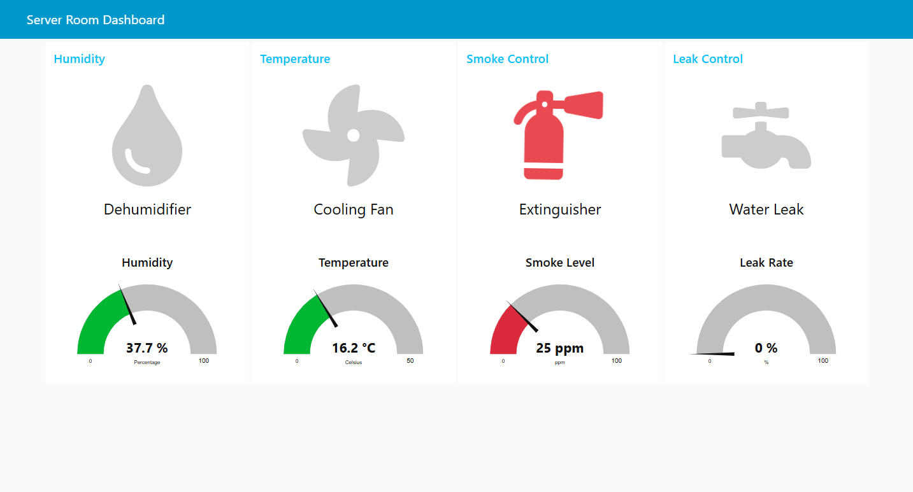
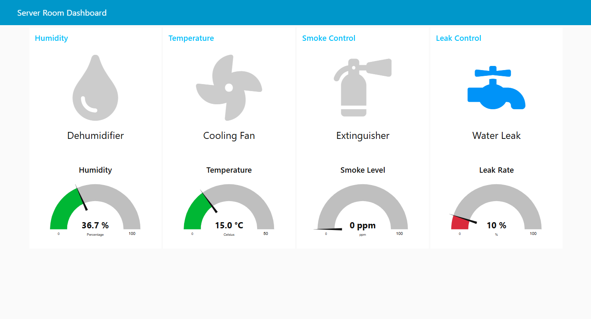
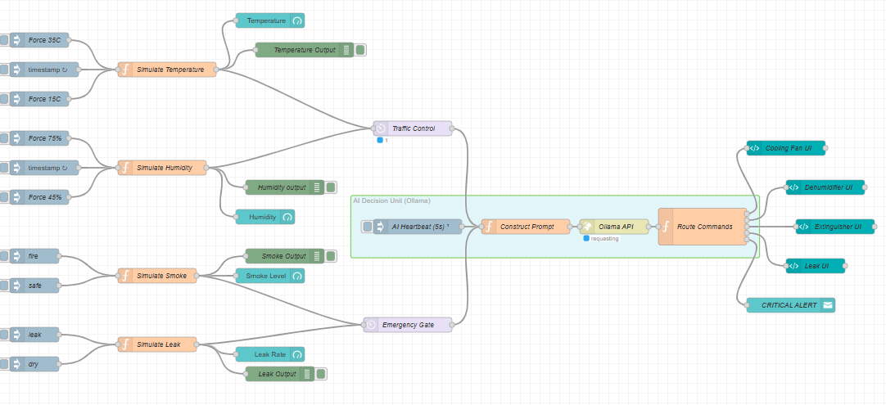

# Edge AI Server Room Monitor

An intelligent, simulated IoT monitoring system for a server room built with **Node-RED**. This project leverages **Edge AI** by integrating a local LLM (**Ollama** running `llama3.2`) to act as an autonomous decision-making unit. It monitors environmental parameters in real-time and triggers safety protocols when anomalies are detected.

## 🌟 Key Features

* **Real-time Sensor Simulation:** Generates dynamic data for Temperature, Humidity, Smoke levels, and Water Leaks.
* **Edge AI Decision Unit:** Uses a locally hosted LLM via Ollama to evaluate multi-sensor states. The AI decides when to activate cooling fans, dehumidifiers, fire extinguishers, or leak alarms based on raw data and rate-of-change (e.g., sudden temperature jumps).
* **Interactive Dashboard:** A sleek Node-RED UI dashboard displaying gauge metrics and animated status icons.
* **Emergency Overrides:** Manual injection nodes to simulate specific crisis scenarios (e.g., forcing a fire, leak, or sudden 35°C temperature spike).
* **Traffic Control & Context Prep:** Implements delay and rate-limiting nodes to prevent API spam, ensuring the local AI is only prompted effectively.

## 📸 Dashboard Previews

### Normal Operation State
*All sensors are within safe thresholds. Actuators are on standby.*


### Emergency State (Critical Alert)
*Anomalies detected (High Temp, Humidity, Smoke, Leak). The AI has autonomously activated all safety countermeasures.*


### ⚙️ Individual Subsystem Activations
The AI dynamically activates specific countermeasures based on isolated environmental anomalies:

| Cooling Fan Active (High Temp) | Dehumidifier Active (High Humidity) |
| :---: | :---: |
|  |  |

| Extinguisher Active (Smoke Detected) | Leak Alarm Active (Water Leak) |
| :---: | :---: |
|  |  |

## 🧠 System Architecture (Node-RED Flow)
The logic flow consists of sensor simulators, traffic control gates, the JSON-based AI prompt constructor, the Ollama API request node, and the response parser routing commands to the UI.



## 🚀 Prerequisites

To run this project locally, you will need:
1.  [Node-RED](https://nodered.org/docs/getting-started/) installed and running.
2.  The `node-red-dashboard` node installed in your Node-RED palette.
3.  [Ollama](https://ollama.com/) installed and running locally.
4.  The `llama3.2` model downloaded in Ollama (`ollama run llama3.2`).

## 🛠️ Installation & Setup

1.  **Clone the repository:**
    ```bash
    git clone [https://github.com/Erfan-Ghafari/EdgeAI-Server-Room-Monitor.git](https://github.com/Erfan-Ghafari/EdgeAI-Server-Room-Monitor.git)
    ```
2.  **Import the Flow:**
    * Open your Node-RED editor (usually `http://localhost:1880`).
    * Click the menu icon (hamburger) in the top right -> **Import**.
    * Select the `EdgeAI-Server-Room-Monitor.json` file from this repository.
    * Click **Import** and then **Deploy**.
3.  **Ensure Ollama is running:**
    * Make sure Ollama is serving the API on `http://localhost:11434` (default).
4.  **Access the Dashboard:**
    * Navigate to `http://localhost:1880/ui` to view and interact with the monitor.

## 🤖 How the AI Brain Works

The system calculates not just the absolute values, but also the rate of change (`temp_diff`, `hum_diff`) over a 5-second heartbeat. It constructs a structured prompt injecting this context and instructs the `llama3.2` model to act as a "Critical IoT Controller". The LLM responds strictly in JSON format, which Node-RED parses to activate or deactivate the relevant UI actuator nodes.